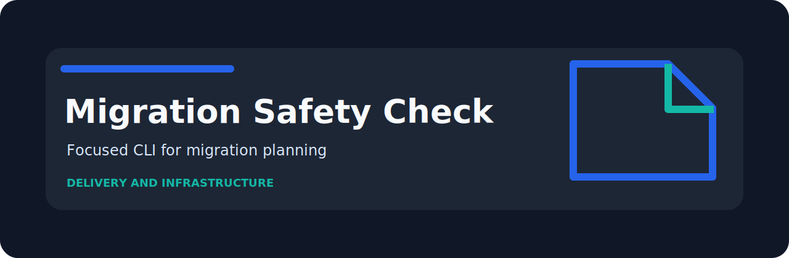

<p align="center">
  
</p>

# Migration Safety Check

   

Review SQL migration notes for destructive operations and rollout gaps.

## Why it exists

Small review tasks are easy to skip when the signal lives in notes, spreadsheets, or loosely formatted exports. `migration-safety-check` turns those checks into a repeatable command with plain findings and CI-friendly exit codes.

## Quick run

```bash
python -m pip install -e ".[dev]"
migration-safety-check examples/sample.txt
migration-safety-check examples/sample.txt --json --fail-on medium
```

## Rule set

| Rule | Severity | What it catches |
| --- | --- | --- |
| `drop-operation` | high | destructive migration operation detected |
| `missing-rollback` | medium | rollback plan is missing |
| `no-transaction` | low | transaction behavior is unclear |

## Input

The reader accepts plain text, JSON, JSONL, and CSV. That keeps it useful for hand-written notes, review exports, and small automation jobs.

## Sample risky input

```text
ALTER TABLE users DROP COLUMN legacy_id; rollback missing; transaction none
```

## Development

```bash
python -m pip install -e ".[dev]"
ruff check .
pytest
python -m migration_safety_check --help
```

`cli.py` handles arguments, `core.py` reads and evaluates records, and `rules.py` keeps the Migration Safety Check policy easy to review.
