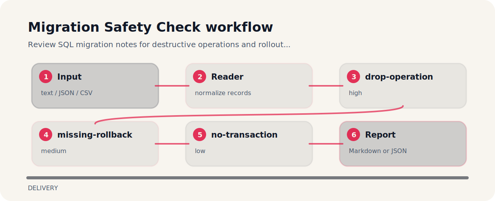

# Migration Safety Check

Review SQL migration notes for destructive operations and rollout gaps.


## Policy flow



## Rule ledger

- `drop-operation` - destructive migration operation detected (high); Use expand-contract rollout and verify backups before deploy..
- `missing-rollback` - rollback plan is missing (medium); Add rollback or recovery steps to the migration plan..
- `no-transaction` - transaction behavior is unclear (low); State whether the migration can run transactionally..

## Where the logic lives

```text
.github/        CI workflow
examples/       sample inputs
src/            package source
tests/          test coverage
```

## One-pass run

```bash
git clone https://github.com/mertefekurt/migration-safety-check.git
cd migration-safety-check
python -m pip install -e ".[dev]"
migration-safety-check examples/sample.txt
```
